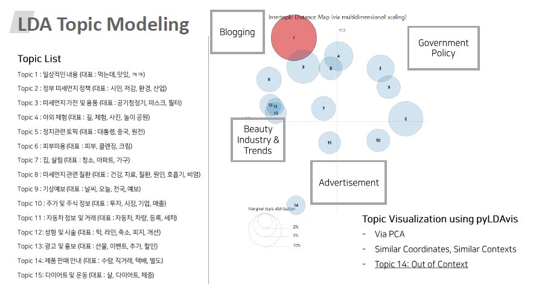

# Combining Topic LDA model and Card Transaction Data

I propose a new business model that tracks floating topics of SNS for marketing; I 1) Identify high correlation between specific topic & products 2) Track topics and propose marketing strategy. 

Selected as one of astonishing projects at 2019 Big Contest & gave oral presentation (Dong Kyu Cho).

### Raw Data :

Our data consists of 5 data:

- Social Network Service (text)
- Card Transaction Data
- Seoul Air Pollution Data (2018)
- Seoul Foot Traffic Data (2018)

Sadly, these are not availiable due to the data policy of 2019 Big Data Conference. 
If you want these data, please consult NIA (https://www.nia.or.kr/site/nia_kor/main.do). 

## Prepocessing and Feature Extraction 

#### ExtractStopwords

Kills stopwords in Korean. 
Codes are fine-tuned in order to find "meaningful" words. 

#### Adjusting_SNS
Due to the nature of Korean, analyzing "morpheme" is essential.
However, it requires high time & space complexitiy. 

This codes reduces such complexity by pre-saving the results. 

#### EDA_card_sales 

Find outliers and get necessary plots. 

## LDA Topic Modeling 

#### Main_Run 
Trains LDA models. 
Results in lda_trained.model. 
For speed & stability, code uses gensim LDA-Multicore. 

#### Make_Dict 
Extracts Topic Model Vector. 

#### LDAvisualized 
Visualizes LDA topics using pyLDAvis. 

## Data Analysis  

#### Dictplot 

#### Add_OrderNWeek 

#### DustPike 

Processes other data & generate necessary plots. 
